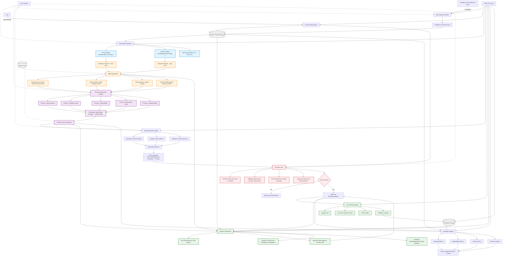

# SpendSense Architecture

## System Overview
SpendSense is a modular, explainable financial insights platform that processes synthetic transaction data through multiple stages: ingestion, signal detection, persona assignment, recommendation generation, and user presentation—all with comprehensive guardrails and operator oversight.

---

## Architecture Diagram



---

## Module Structure

```
spendsense/
├── ingest/
│   ├── __init__.py
│   ├── data_generator.py      # Synthetic data creation
│   ├── loader.py               # CSV/JSON ingestion
│   └── validator.py            # Schema validation
│
├── features/
│   ├── __init__.py
│   ├── windowing.py            # Time window partitioning
│   ├── subscriptions.py        # Subscription detection
│   ├── savings.py              # Savings signal computation
│   ├── credit.py               # Credit utilization analysis
│   ├── income.py               # Income stability detection
│   └── aggregator.py           # Signal aggregation
│
├── personas/
│   ├── __init__.py
│   ├── criteria.py             # Persona matching logic
│   ├── prioritization.py       # Tie-breaking and selection
│   └── assignment.py           # Primary persona assignment
│
├── recommend/
│   ├── __init__.py
│   ├── catalog.py              # Static education content
│   ├── offers.py               # Partner offer generation
│   ├── rationale.py            # Plain-language explanation
│   └── llm_integration.py      # Optional LLM enhancement
│
├── guardrails/
│   ├── __init__.py
│   ├── consent.py              # Consent tracking and enforcement
│   ├── eligibility.py          # Product eligibility checks
│   ├── tone.py                 # Tone validation (no shaming)
│   └── disclosure.py           # Disclaimer injection
│
├── ui/
│   ├── __init__.py
│   ├── user_dashboard.py       # User-facing web interface
│   ├── operator_dashboard.py   # Operator oversight interface
│   └── feedback.py             # Feedback collection system
│
├── eval/
│   ├── __init__.py
│   ├── metrics.py              # Coverage, explainability, latency
│   ├── fairness.py             # Income-based fairness analysis
│   └── reporting.py            # Chart generation and reports
│
├── api/
│   ├── __init__.py
│   ├── routes.py               # REST endpoints
│   └── middleware.py           # Authentication, logging
│
├── storage/
│   ├── __init__.py
│   ├── sqlite_manager.py       # SQLite operations
│   ├── parquet_handler.py      # Parquet analytics
│   └── cache.py                # Signal caching
│
├── utils/
│   ├── __init__.py
│   ├── config.py               # Configuration management
│   ├── logger.py               # Logging utilities
│   └── errors.py               # Error handling
│
├── docs/
│   ├── decision_log.md         # Architecture decisions
│   ├── schema.md               # Database schemas
│   ├── persona_criteria.md     # Detailed persona rules
│   ├── limitations.md          # Known limitations
│   ├── ai_prompts.md           # LLM prompts (if used)
│   └── evaluation_results.md   # Metrics and fairness
│
├── tests/
│   ├── unit/                   # Unit tests
│   ├── integration/            # Integration tests
│   └── edge_cases/             # Edge case tests
│
├── requirements.txt
├── setup.py
├── README.md
└── run.py                      # Single-command startup
```

---

## Data Flow

### 1. **Ingestion Phase**
```
Synthetic Data → Validation → SQLite (accounts, transactions, liabilities)
                            → Parquet (analytics copy)
```

### 2. **Consent Check**
```
User Request → Check consent_status table → Proceed or Block
```

### 3. **Signal Detection**
```
Transactions → Window Partitioning (30d, 180d) → Signal Computation
→ Cache Results → Signal Aggregator
```

### 4. **Persona Assignment**
```
Aggregated Signals → Match All Personas → Apply Priority → Tie-Breaking
→ Assign Primary Persona → Log Decision Trace
```

### 5. **Recommendation Generation**
```
Primary Persona → Fetch Education Content → Generate Partner Offers
→ Create Rationales → Apply Guardrails → Output Recommendations
```

### 6. **User Experience**
```
Recommendations → User Dashboard → Display with Feedback Buttons
→ User Interaction → Store Feedback → Feed to Evaluation
```

### 7. **Operator Oversight**
```
Recommendations → Approval Queue → Operator Review → Approve/Override
→ Updated Recommendations → User Dashboard
```

### 8. **Evaluation**
```
All Recommendations → Compute Metrics → Fairness Analysis
→ Generate Reports → JSON/CSV + Charts
```

---

## Storage Schema

### **Users Table**
```sql
CREATE TABLE users (
    user_id TEXT PRIMARY KEY,
    created_at TIMESTAMP,
    consent_status BOOLEAN,
    consent_timestamp TIMESTAMP,
    last_updated TIMESTAMP
);
```

### **Accounts Table**
```sql
CREATE TABLE accounts (
    account_id TEXT PRIMARY KEY,
    user_id TEXT,
    type TEXT,
    subtype TEXT,
    balance_available REAL,
    balance_current REAL,
    balance_limit REAL,
    iso_currency_code TEXT,
    FOREIGN KEY (user_id) REFERENCES users(user_id)
);
```

### **Transactions Table**
```sql
CREATE TABLE transactions (
    transaction_id TEXT PRIMARY KEY,
    account_id TEXT,
    date DATE,
    amount REAL,
    merchant_name TEXT,
    merchant_entity_id TEXT,
    payment_channel TEXT,
    category_primary TEXT,
    category_detailed TEXT,
    pending BOOLEAN,
    FOREIGN KEY (account_id) REFERENCES accounts(account_id)
);
```

### **Liabilities Table**
```sql
CREATE TABLE liabilities (
    liability_id TEXT PRIMARY KEY,
    account_id TEXT,
    type TEXT,
    apr REAL,
    minimum_payment REAL,
    last_payment REAL,
    is_overdue BOOLEAN,
    next_payment_due DATE,
    last_statement_balance REAL,
    FOREIGN KEY (account_id) REFERENCES accounts(account_id)
);
```

### **Signals Table (Cache)**
```sql
CREATE TABLE signals (
    signal_id TEXT PRIMARY KEY,
    user_id TEXT,
    window_type TEXT,  -- '30d' or '180d'
    computed_at TIMESTAMP,
    subscriptions_count INTEGER,
    recurring_spend REAL,
    savings_growth_rate REAL,
    credit_utilization REAL,
    income_buffer_months REAL,
    FOREIGN KEY (user_id) REFERENCES users(user_id)
);
```

### **Personas Table**
```sql
CREATE TABLE personas (
    assignment_id TEXT PRIMARY KEY,
    user_id TEXT,
    persona_name TEXT,
    assigned_at TIMESTAMP,
    priority_level INTEGER,
    signal_strength REAL,
    decision_trace TEXT,  -- JSON
    FOREIGN KEY (user_id) REFERENCES users(user_id)
);
```

### **Recommendations Table**
```sql
CREATE TABLE recommendations (
    recommendation_id TEXT PRIMARY KEY,
    user_id TEXT,
    persona_name TEXT,
    type TEXT,  -- 'education' or 'offer'
    title TEXT,
    rationale TEXT,
    generated_at TIMESTAMP,
    operator_status TEXT,  -- 'pending', 'approved', 'overridden'
    FOREIGN KEY (user_id) REFERENCES users(user_id)
);
```

### **Feedback Table**
```sql
CREATE TABLE feedback (
    feedback_id TEXT PRIMARY KEY,
    recommendation_id TEXT,
    user_id TEXT,
    thumbs_up BOOLEAN,
    helped_me BOOLEAN,
    applied_this BOOLEAN,
    free_text TEXT,
    submitted_at TIMESTAMP,
    FOREIGN KEY (recommendation_id) REFERENCES recommendations(recommendation_id)
);
```

---

## REST API Endpoints

### **User Management**
- `POST /users` - Create synthetic user
- `POST /consent` - Record consent opt-in
- `DELETE /consent/{user_id}` - Revoke consent
- `GET /consent/{user_id}` - Check consent status

### **Data & Analysis**
- `GET /profile/{user_id}` - Get behavioral signals and persona
- `GET /recommendations/{user_id}` - Get recommendations with rationales
- `POST /feedback` - Submit user feedback

### **Operator**
- `GET /operator/review` - Approval queue
- `POST /operator/approve/{recommendation_id}` - Approve recommendation
- `POST /operator/override/{recommendation_id}` - Override with custom content
- `POST /operator/bulk_approve` - Bulk approve by persona
- `GET /operator/analytics` - System metrics and charts
- `GET /operator/feedback` - Aggregated user feedback

### **Evaluation**
- `GET /eval/metrics` - Retrieve current metrics
- `POST /eval/run` - Trigger evaluation run
- `GET /eval/fairness` - Fairness analysis report

---

## Performance Considerations

### **Caching Strategy**
- Cache computed signals per user per window
- Invalidate cache when new transactions arrive
- TTL: 24 hours (windows recalculate daily)

### **Query Optimization**
- Index on `user_id`, `date`, `account_id`
- Parquet for analytical queries (aggregations)
- SQLite for transactional operations

### **Latency Target: <5 seconds**
- Pre-compute signals for all users daily
- Lazy-load recommendations on demand
- Parallel processing for batch operations

---

## Error Handling

### **Graceful Degradation**
- Missing data: Use defaults or skip non-critical signals
- Invalid transactions: Log and exclude from analysis
- LLM unavailable: Fallback to static catalog
- Zero transactions: Assign "Welcome" persona

### **Error Logging**
- Log all exceptions with context
- Track data quality issues
- Alert operator on critical failures

---

## Security & Privacy

### **Data Protection**
- No real PII (synthetic data only)
- Masked account numbers
- Local storage only (no external transmission)
- Consent enforced at API layer

### **Operator Access**
- Basic authentication for operator dashboard
- Audit log of all operator actions
- No PII exposure in logs

---

## Deployment

### **Local Setup**
```bash
# One-command setup
python run.py --setup

# Start backend + frontend
python run.py --start
```

### **Dependencies**
- Python 3.9+
- SQLite (built-in)
- Pandas, NumPy (data processing)
- Flask/FastAPI (API)
- Optional: OpenAI/Anthropic SDK (LLM)

---

## Testing Architecture

### **Unit Tests (15 tests)**
- Signal computation accuracy
- Persona criteria boundary testing
- Guardrail enforcement
- Rationale generation format

### **Integration Tests (8 tests)**
- End-to-end flow (ingest → recommendations)
- Multi-persona prioritization
- Consent revocation effects
- Operator override workflow

### **Edge Case Tests (5 tests)**
- New users (<7 days)
- Zero balance accounts
- Pending-only transactions
- Negative savings growth
- Simultaneous persona changes

### **Performance Tests (2 tests)**
- 100 users <5 seconds each
- Operator dashboard load time <3 seconds

---

## Monitoring & Observability

### **Key Metrics**
- Recommendation generation latency
- Signal detection coverage
- Persona assignment distribution
- User engagement rates
- Operator approval rates

### **Dashboards**
- Real-time system health
- Daily metrics summary
- Fairness monitoring
- Error rate tracking